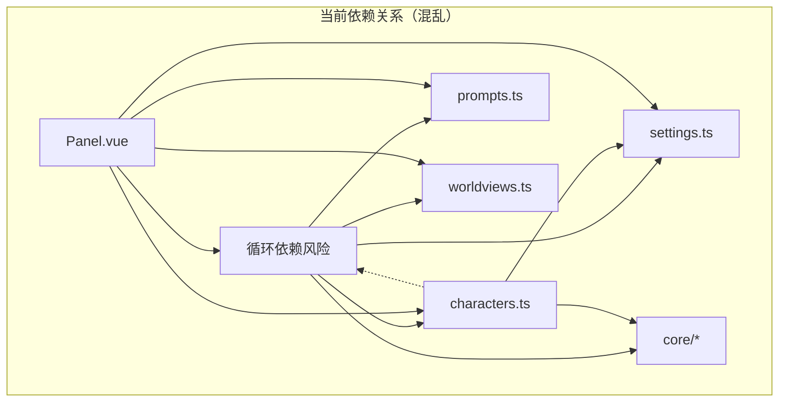
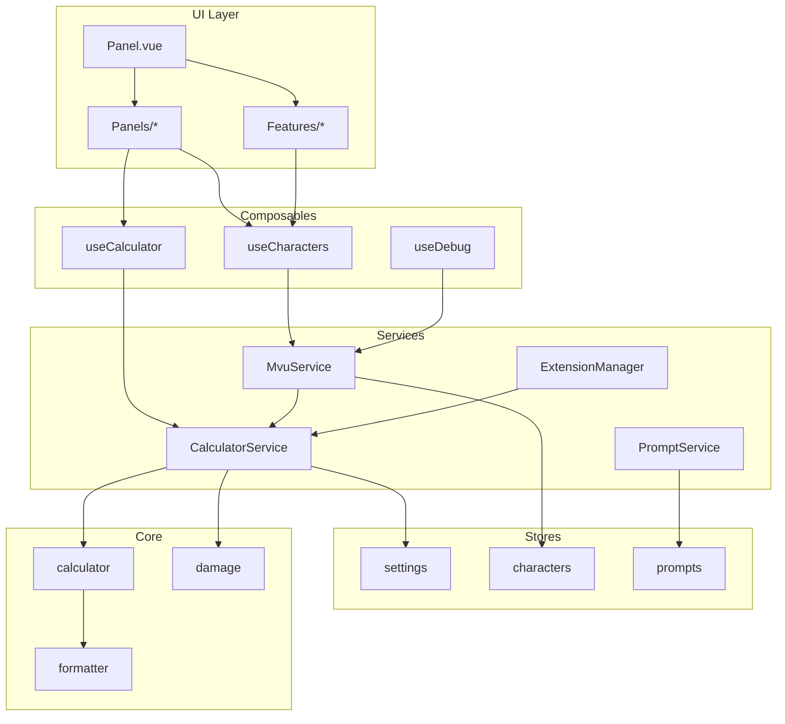

# 巨大娘计算器 - 架构解耦设计方案

> 版本：v1.1  
> 日期：2024年  
> 状态：Phase 6 完成（全部阶段完成）

---

## 目录

1. [项目概述](#1-项目概述)
2. [当前架构问题分析](#2-当前架构问题分析)
3. [目标架构设计](#3-目标架构设计)
4. [目录结构设计](#4-目录结构设计)
5. [核心接口定义](#5-核心接口定义)
6. [扩展系统设计](#6-扩展系统设计)
7. [分阶段实施计划](#7-分阶段实施计划)
8. [迁移策略](#8-迁移策略)
9. [预期收益](#9-预期收益)
10. [附录](#10-附录)

---

## 1. 项目概述

### 1.1 项目背景

「巨大娘计算器」是一个酒馆助手脚本，用于角色扮演场景中的尺寸计算和辅助。主要功能包括：

- 身体数据计算（根据身高计算各部位尺寸）
- 相对尺寸参照（计算参考物在角色眼中的相对大小）
- 互动限制检查（判断物理合理性）
- 损害计算系统（计算巨大娘行动造成的破坏）
- 提示词自动注入
- 世界观模板系统

### 1.2 重构动机

随着功能的不断迭代，代码库出现了严重的耦合问题，影响了：

- 代码可维护性
- 功能可扩展性
- 单元测试可行性
- 团队协作效率

---

## 2. 当前架构问题分析

### 2.1 超大文件问题

| 文件 | 行数 | 问题描述 |
|------|------|----------|
| `mvu集成.ts` | 1022行 | 混合7+种职责：MVU处理、历史记录、互动计算、提示词注入、损害计算、调试、全局API |
| `Panel.vue` | 3342行 | 包含6个独立面板：设置、帮助、世界观、提示词、调试、扩展系统 |
| `CharacterList.vue` | 901行 | 包含普通展示+损害数据+实际损害记录+历史记录 |

### 2.2 职责混乱（以 mvu集成.ts 为例）

```
mvu集成.ts 当前职责：
├── handleVariableUpdate()         # MVU事件处理
├── addHeightHistory()             # 身高历史管理
├── calculatePairwiseInteractions() # 互动限制计算
├── buildCharacterContext()        # 上下文构建
├── generateAllDamagePrompt()      # 损害提示词生成
├── injectGiantessPrompt()         # 提示词注入
├── getMvuDebugInfo()              # 调试信息收集
├── injectTestData()               # 测试数据注入
├── clearTestData()                # 测试数据清理
└── exposeGlobalFunctions()        # 全局API暴露
```

### 2.3 依赖关系问题



**问题**：

- 模块间相互依赖，形成网状结构
- 存在循环依赖风险
- 无法独立测试单个模块

### 2.4 扩展性问题

- 损害计算硬编码在 `mvu集成.ts` 中
- 添加新功能需要修改多处代码
- 没有统一的扩展机制
- 功能开关分散在各处

### 2.5 UI 组件问题

- Panel.vue 包含过多业务逻辑
- 样式代码占据大量行数（约1800行）
- 面板状态管理复杂
- 组件复用性差

---

## 3. 目标架构设计

### 3.1 设计原则

1. **分层架构**：清晰的层次划分，每层有明确职责
2. **单向依赖**：上层依赖下层，禁止反向依赖
3. **职责单一**：每个模块只负责一件事
4. **接口隔离**：通过接口而非实现进行通信
5. **可扩展性**：通过扩展系统支持功能插拔

### 3.2 分层架构图

```
┌─────────────────────────────────────────────────────────────────────────┐
│                           UI Layer (Vue)                                 │
│  ┌─────────────┐ ┌─────────────┐ ┌─────────────┐ ┌─────────────┐        │
│  │   Panel     │ │  Panels/*   │ │ Features/*  │ │Components/* │        │
│  └──────┬──────┘ └──────┬──────┘ └──────┬──────┘ └──────┬──────┘        │
├─────────┼───────────────┼───────────────┼───────────────┼───────────────┤
│         └───────────────┴───────────────┴───────────────┘               │
│                        Composables Layer                                 │
│  ┌─────────────┐ ┌─────────────┐ ┌─────────────┐ ┌─────────────┐        │
│  │ useCalc     │ │ useChars    │ │ usePrompts  │ │ useDebug    │        │
│  └──────┬──────┘ └──────┬──────┘ └──────┬──────┘ └──────┬──────┘        │
├─────────┼───────────────┼───────────────┼───────────────┼───────────────┤
│         └───────────────┴───────────────┴───────────────┘               │
│                         Services Layer                                   │
│  ┌─────────────┐ ┌─────────────┐ ┌─────────────┐ ┌─────────────┐        │
│  │ Calculator  │ │   Prompt    │ │    MVU      │ │  Extension  │        │
│  │  Service    │ │  Service    │ │  Service    │ │   Manager   │        │
│  └──────┬──────┘ └──────┬──────┘ └──────┬──────┘ └──────┬──────┘        │
├─────────┼───────────────┼───────────────┼───────────────┼───────────────┤
│         └───────────────┴───────────────┴───────────────┘               │
│                         Stores Layer (Pinia)                             │
│  ┌─────────────┐ ┌─────────────┐ ┌─────────────┐ ┌─────────────┐        │
│  │  settings   │ │ characters  │ │  prompts    │ │ worldviews  │        │
│  └──────┬──────┘ └──────┬──────┘ └──────┬──────┘ └──────┬──────┘        │
├─────────┼───────────────┼───────────────┼───────────────┼───────────────┤
│         └───────────────┴───────────────┴───────────────┘               │
│                          Core Layer (Pure)                               │
│  ┌─────────────┐ ┌─────────────┐ ┌─────────────┐ ┌─────────────┐        │
│  │ calculator  │ │  formatter  │ │   damage    │ │interactions │        │
│  └─────────────┘ └─────────────┘ └─────────────┘ └─────────────┘        │
└─────────────────────────────────────────────────────────────────────────┘
```

### 3.3 各层职责

| 层级 | 职责 | 依赖 | 特点 |
|------|------|------|------|
| **Core** | 纯计算逻辑 | 无 | 纯函数，零外部依赖，可独立测试 |
| **Stores** | 状态管理 | Core | 只管理状态，不包含业务逻辑 |
| **Services** | 业务协调 | Core, Stores | 协调多个模块完成复杂业务 |
| **Composables** | UI逻辑 | Services, Stores | 封装Vue组件的响应式逻辑 |
| **UI** | 视图渲染 | Composables | 只负责展示和用户交互 |

### 3.4 数据流向

```
单向数据流（读取）：
MVU Event 
  → services/mvu/handler 
  → services/calculator 
  → stores/characters 
  → composables 
  → UI

用户操作（写入）：
UI Action 
  → composables 
  → services 
  → stores 
  → 触发 watch 更新 UI
```

---

## 4. 目录结构设计

### 4.1 完整目录结构

```
src/
├── types/                          # 1. 类型定义（全局共享）
│   ├── calculator.ts               # 计算相关类型
│   ├── character.ts                # 角色数据类型
│   ├── damage.ts                   # 损害计算类型
│   ├── prompt.ts                   # 提示词类型
│   ├── worldview.ts                # 世界观类型
│   ├── extension.ts                # 扩展系统类型
│   └── index.ts                    # 统一导出
│
├── core/                           # 2. 核心计算（纯函数，零外部依赖）
│   ├── constants/                  # 常量定义
│   │   ├── body-parts.ts           # 身体部位基准数据
│   │   ├── references.ts           # 参照物尺寸
│   │   ├── levels.ts               # 级别定义
│   │   └── index.ts
│   ├── calculator/                 # 计算器
│   │   ├── giantess.ts             # 巨大娘计算
│   │   ├── tiny.ts                 # 小人计算
│   │   ├── level.ts                # 级别判定
│   │   └── index.ts
│   ├── damage/                     # 损害计算（独立模块）
│   │   ├── constants.ts            # 人口密度等常量
│   │   ├── calculator.ts           # 损害计算逻辑
│   │   ├── formatter.ts            # 损害格式化
│   │   └── index.ts
│   ├── interactions/               # 互动限制
│   │   ├── rules.ts                # 规则定义
│   │   ├── checker.ts              # 限制检查
│   │   └── index.ts
│   ├── formatter/                  # 通用格式化
│   │   ├── length.ts
│   │   ├── weight.ts
│   │   ├── area.ts
│   │   └── index.ts
│   └── index.ts                    # Core层统一导出
│
├── stores/                         # 3. 状态管理（薄层，只管理状态）
│   ├── settings.ts                 # 设置状态
│   ├── characters.ts               # 角色状态（精简版）
│   ├── prompts.ts                  # 提示词状态
│   ├── worldviews.ts               # 世界观状态
│   └── index.ts
│
├── services/                       # 4. 业务服务（协调层）
│   ├── calculator/                 # 计算服务
│   │   ├── character-calculator.ts # 角色数据计算
│   │   ├── interaction-calculator.ts # 互动限制计算
│   │   └── index.ts
│   ├── prompt/                     # 提示词服务
│   │   ├── builder.ts              # 提示词构建
│   │   ├── injector.ts             # 提示词注入
│   │   └── index.ts
│   ├── mvu/                        # MVU 集成服务
│   │   ├── handler.ts              # 事件处理
│   │   ├── history.ts              # 历史记录
│   │   └── index.ts
│   ├── extensions/                 # 扩展管理
│   │   ├── manager.ts              # 扩展管理器
│   │   ├── damage-extension.ts     # 损害计算扩展
│   │   └── index.ts
│   ├── debug/                      # 调试服务
│   │   ├── info-collector.ts       # 信息收集
│   │   ├── test-injector.ts        # 测试注入
│   │   └── index.ts
│   ├── global-api.ts               # 全局 API 暴露
│   └── index.ts
│
├── composables/                    # 5. Vue Composables（UI逻辑层）
│   ├── useCalculator.ts            # 快速计算逻辑
│   ├── useCharacters.ts            # 角色管理逻辑
│   ├── useSettings.ts              # 设置面板逻辑
│   ├── useWorldview.ts             # 世界观面板逻辑
│   ├── usePrompts.ts               # 提示词管理逻辑
│   ├── useDebug.ts                 # 调试面板逻辑
│   ├── useExtensions.ts            # 扩展系统逻辑
│   └── index.ts
│
├── ui/                             # 6. UI 组件层
│   ├── components/                 # 通用原子组件
│   │   ├── GcSwitch.vue            # 开关组件
│   │   ├── GcInput.vue             # 输入框组件
│   │   ├── GcButton.vue            # 按钮组件
│   │   ├── GcBadge.vue             # 徽章组件
│   │   ├── GcCard.vue              # 卡片组件
│   │   ├── GcOverlay.vue           # 覆盖层组件
│   │   └── index.ts
│   ├── panels/                     # 面板组件
│   │   ├── SettingsPanel.vue       # 设置面板 (~100行)
│   │   ├── HelpPanel.vue           # 帮助面板 (~80行)
│   │   ├── WorldviewPanel.vue      # 世界观面板 (~200行)
│   │   ├── PromptsPanel.vue        # 提示词面板 (~250行)
│   │   ├── DebugPanel.vue          # 调试面板 (~300行)
│   │   └── ExtensionsPanel.vue     # 扩展面板 (~150行)
│   ├── features/                   # 功能组件
│   │   ├── QuickCalc.vue           # 快速计算
│   │   ├── CharacterCard.vue       # 角色卡片
│   │   ├── CharacterList.vue       # 角色列表
│   │   ├── Result.vue              # 计算结果
│   │   ├── DamageDisplay.vue       # 损害数据展示
│   │   └── ActualDamage.vue        # 实际损害记录
│   ├── styles/                     # 样式文件
│   │   ├── variables.css           # CSS 变量
│   │   ├── components.css          # 组件样式
│   │   └── panels.css              # 面板样式
│   └── Panel.vue                   # 主面板容器 (~200行)
│
├── 初始化.ts                       # 初始化入口
├── 设置界面.ts                     # Vue 挂载
├── version.ts                      # 版本信息
└── index.ts                        # 脚本入口
```

### 4.2 文件命名规范

| 类型 | 命名规范 | 示例 |
|------|----------|------|
| 类型文件 | 小写短横线 | `character.ts`, `prompt-context.ts` |
| 组件文件 | PascalCase | `CharacterCard.vue`, `DebugPanel.vue` |
| Composable | camelCase + use前缀 | `useCalculator.ts`, `useDebug.ts` |
| 服务文件 | 小写短横线 | `character-calculator.ts`, `prompt-builder.ts` |
| 常量文件 | 小写短横线 | `body-parts.ts`, `population-density.ts` |

---

## 5. 核心接口定义

### 5.1 类型定义文件

#### types/character.ts

```typescript
/**
 * 角色基础数据（从 MVU 变量读取）
 */
export interface CharacterRawData {
  当前身高?: number;
  身高?: number;
  原身高?: number;
  原始身高?: number;
  变化原因?: string;
  变化时间?: string;
  自定义部位?: Record<string, number>;
}

/**
 * 角色计算结果
 */
export interface CharacterCalcData {
  原身高: number;
  当前身高: number;
  当前身高_格式化: string;
  倍率: number;
  级别: string;
  级别描述: string;
  类型: 'giant' | 'tiny';
  身体部位: Record<string, number>;
  身体部位_格式化: Record<string, string>;
  自定义部位: Record<string, number>;
  自定义部位_倍率: Record<string, number>;
  眼中的世界: Record<string, number>;
  眼中的世界_格式化: Record<string, string>;
  描述: string;
}

/**
 * 身高历史记录
 */
export interface HeightHistoryRecord {
  身高: number;
  身高_格式化: string;
  时间戳: number;
  时间点: string;
  原因: string;
  变化?: '增大' | '缩小';
  变化倍率?: number;
}

/**
 * 完整角色数据（Store 中使用）
 */
export interface CharacterData {
  name: string;
  currentHeight: number;
  originalHeight: number;
  changeReason?: string;
  changeTime?: string;
  calcData?: CharacterCalcData;
  damageData?: DamageCalculation;
  actualDamage?: ActualDamageRecord;
  history?: HeightHistoryRecord[];
}
```

#### types/damage.ts

```typescript
/**
 * 损害计算结果
 */
export interface DamageCalculation {
  破坏力等级: string;
  足迹影响: FootprintImpact;
  单步损害: StepDamage;
  宏观损害: MacroDamage;
  特殊效应: string[];
  _计算参数: {
    当前身高: number;
    原身高: number;
    场景: string;
    人口密度: number;
    建筑密度: number;
  };
}

/**
 * 实际损害记录（由 LLM 或用户记录）
 */
export interface ActualDamageRecord {
  总伤亡人数?: number;
  总建筑损毁?: number;
  总城市毁灭?: number;
  最近行动?: {
    描述: string;
    伤亡人数?: number;
    建筑损毁?: number;
    特殊破坏?: string;
    时间点?: string;
  };
  重大事件?: Array<{
    描述: string;
    伤亡人数?: number;
    建筑损毁?: number;
    时间点?: string;
  }>;
  备注?: string;
}
```

#### types/extension.ts

```typescript
import type { Component } from 'vue';
import type { CharacterData, CharacterCalcData } from './character';
import type { PromptContext, PromptTemplate } from './prompt';

/**
 * 扩展定义
 */
export interface Extension {
  /** 扩展唯一标识 */
  id: string;
  
  /** 扩展名称 */
  name: string;
  
  /** 扩展描述 */
  description: string;
  
  /** 图标（Font Awesome 类名） */
  icon: string;
  
  /** 是否默认启用 */
  defaultEnabled?: boolean;
  
  /** 依赖的其他扩展 */
  dependencies?: string[];
  
  // ========== 生命周期钩子 ==========
  
  /** 扩展启用时调用 */
  onEnable?: () => void | Promise<void>;
  
  /** 扩展禁用时调用 */
  onDisable?: () => void | Promise<void>;
  
  /** 初始化时调用（无论是否启用） */
  onInit?: () => void | Promise<void>;
  
  // ========== 计算钩子 ==========
  
  /** 角色数据更新后调用 */
  onCharacterUpdate?: (
    character: CharacterData,
    calcData: CharacterCalcData
  ) => void | Record<string, unknown>;
  
  /** 提示词注入前调用，可以修改上下文 */
  onBeforePromptInject?: (context: PromptContext) => PromptContext;
  
  /** 提示词注入后调用 */
  onAfterPromptInject?: (promptId: string) => void;
  
  // ========== 内容贡献 ==========
  
  /** 贡献的提示词模板 */
  getPromptTemplates?: () => PromptTemplate[];
  
  /** 贡献的设置项组件 */
  getSettingsComponent?: () => Component;
  
  /** 贡献的角色卡片额外内容 */
  getCharacterCardExtra?: () => Component;
  
  /** 贡献的调试面板内容 */
  getDebugPanelExtra?: () => Component;
}

/**
 * 扩展注册表
 */
export interface ExtensionRegistry {
  /** 注册扩展 */
  register(extension: Extension): void;
  
  /** 获取扩展 */
  get(id: string): Extension | undefined;
  
  /** 获取所有扩展 */
  getAll(): Extension[];
  
  /** 获取已启用的扩展 */
  getEnabled(): Extension[];
  
  /** 启用扩展 */
  enable(id: string): void;
  
  /** 禁用扩展 */
  disable(id: string): void;
  
  /** 检查扩展是否启用 */
  isEnabled(id: string): boolean;
}
```

### 5.2 服务接口

#### services/calculator/index.ts

```typescript
import type { CharacterRawData, CharacterCalcData } from '@/types';

export interface CalculatorService {
  /**
   * 计算角色完整数据
   */
  calculate(
    currentHeight: number,
    originalHeight: number,
    customParts?: Record<string, number>
  ): CharacterCalcData;
  
  /**
   * 从原始数据计算
   */
  calculateFromRaw(raw: CharacterRawData): CharacterCalcData | null;
  
  /**
   * 判断是巨大娘还是小人
   */
  getType(scale: number): 'giant' | 'tiny' | 'normal';
}
```

#### services/mvu/index.ts

```typescript
export interface MvuService {
  /**
   * 初始化 MVU 集成
   */
  init(): void;
  
  /**
   * 手动触发变量处理
   */
  processVariables(): void;
  
  /**
   * 获取当前 MVU 状态
   */
  getStatus(): MvuStatus;
  
  /**
   * 注入测试数据
   */
  injectTestData(
    name: string,
    height: number,
    originalHeight?: number
  ): { success: boolean; error?: string };
  
  /**
   * 清除测试数据
   */
  clearTestData(name?: string): { success: boolean; error?: string };
}

export interface MvuStatus {
  available: boolean;
  version: string | null;
  prefix: string;
  hasData: boolean;
  characterCount: number;
}
```

#### services/prompt/index.ts

```typescript
import type { PromptContext, PromptTemplate } from '@/types';

export interface PromptService {
  /**
   * 构建完整提示词
   */
  build(contexts: PromptContext[]): string;
  
  /**
   * 注入提示词到聊天
   */
  inject(content: string, depth?: number): string;
  
  /**
   * 取消之前的注入
   */
  uninject(): void;
  
  /**
   * 插值模板
   */
  interpolate(template: string, context: Partial<PromptContext>): string;
}
```

---

## 6. 扩展系统设计

### 6.1 扩展系统架构

```
┌─────────────────────────────────────────────────────────┐
│                    Extension Manager                     │
│  ┌─────────────────────────────────────────────────────┐│
│  │                  Extension Registry                 ││
│  │  ┌──────────┐ ┌──────────┐ ┌──────────┐            ││
│  │  │ Damage   │ │  Vore    │ │  Custom  │ ...        ││
│  │  │Extension │ │Extension │ │Extension │            ││
│  │  └────┬─────┘ └────┬─────┘ └────┬─────┘            ││
│  └───────┼────────────┼────────────┼───────────────────┘│
│          │            │            │                     │
│  ┌───────┴────────────┴────────────┴───────────────────┐│
│  │                    Hook System                      ││
│  │  onCharacterUpdate │ onBeforePromptInject │ ...    ││
│  └─────────────────────────────────────────────────────┘│
└─────────────────────────────────────────────────────────┘
```

### 6.2 扩展管理器实现

```typescript
// services/extensions/manager.ts

import type { Extension, ExtensionRegistry } from '@/types';

class ExtensionManager implements ExtensionRegistry {
  private extensions = new Map<string, Extension>();
  private enabledSet = new Set<string>();
  
  register(extension: Extension): void {
    if (this.extensions.has(extension.id)) {
      console.warn(`Extension ${extension.id} already registered`);
      return;
    }
    
    this.extensions.set(extension.id, extension);
    
    // 调用初始化钩子
    extension.onInit?.();
    
    // 如果默认启用
    if (extension.defaultEnabled) {
      this.enable(extension.id);
    }
  }
  
  enable(id: string): void {
    const ext = this.extensions.get(id);
    if (!ext) return;
    
    // 检查依赖
    if (ext.dependencies) {
      for (const depId of ext.dependencies) {
        if (!this.isEnabled(depId)) {
          console.warn(`Cannot enable ${id}: dependency ${depId} not enabled`);
          return;
        }
      }
    }
    
    this.enabledSet.add(id);
    ext.onEnable?.();
  }
  
  disable(id: string): void {
    const ext = this.extensions.get(id);
    if (!ext) return;
    
    // 检查是否有其他扩展依赖它
    for (const [otherId, other] of this.extensions) {
      if (other.dependencies?.includes(id) && this.isEnabled(otherId)) {
        console.warn(`Cannot disable ${id}: ${otherId} depends on it`);
        return;
      }
    }
    
    this.enabledSet.delete(id);
    ext.onDisable?.();
  }
  
  // 触发钩子
  triggerHook<T extends keyof Extension>(
    hookName: T,
    ...args: Parameters<NonNullable<Extension[T]>>
  ): void {
    for (const ext of this.getEnabled()) {
      const hook = ext[hookName];
      if (typeof hook === 'function') {
        (hook as Function).apply(ext, args);
      }
    }
  }
  
  // ... 其他方法
}

export const extensionManager = new ExtensionManager();
```

### 6.3 损害计算扩展示例

```typescript
// services/extensions/damage-extension.ts

import type { Extension } from '@/types';
import { calculateDamage, generateDamagePrompt } from '@/core/damage';
import { useSettingsStore } from '@/stores/settings';
import DamageDisplay from '@/ui/features/DamageDisplay.vue';
import DamageSettings from '@/ui/panels/DamageSettings.vue';

export const damageExtension: Extension = {
  id: 'damage-calculation',
  name: '损害计算',
  description: '计算巨大娘行动可能造成的破坏（伤亡、建筑损毁等）',
  icon: 'fa-solid fa-explosion',
  defaultEnabled: false,
  
  onEnable() {
    console.log('[DamageExtension] 损害计算已启用');
  },
  
  onDisable() {
    console.log('[DamageExtension] 损害计算已禁用');
  },
  
  onCharacterUpdate(character, calcData) {
    // 只对巨大娘计算损害
    if (calcData.类型 !== 'giant') return;
    
    const settings = useSettingsStore();
    const scenario = settings.settings.damageScenario;
    
    const damageData = calculateDamage(
      calcData.当前身高,
      calcData.原身高,
      scenario
    );
    
    // 返回要写入 MVU 变量的额外数据
    return {
      _损害数据: damageData,
    };
  },
  
  getPromptTemplates() {
    return [
      {
        id: 'damage-calculation',
        name: '损害计算',
        description: '每个角色行动可能造成的破坏数据',
        enabled: true,
        order: 25,
        type: 'damage',
        builtin: true,
        requiresFeature: 'damageCalculation',
        content: `---\n\n# 破坏力数据\n\n{{损害数据}}`,
      },
    ];
  },
  
  getCharacterCardExtra() {
    return DamageDisplay;
  },
  
  getSettingsComponent() {
    return DamageSettings;
  },
};
```

### 6.4 扩展注册流程

```typescript
// services/extensions/index.ts

import { extensionManager } from './manager';
import { damageExtension } from './damage-extension';
// import { voreExtension } from './vore-extension';  // 未来扩展

/**
 * 注册所有内置扩展
 */
export function registerBuiltinExtensions(): void {
  extensionManager.register(damageExtension);
  // extensionManager.register(voreExtension);
}

/**
 * 初始化扩展系统
 */
export function initExtensions(): void {
  registerBuiltinExtensions();
  
  // 从设置中恢复启用状态
  const settings = useSettingsStore();
  if (settings.settings.enableDamageCalculation) {
    extensionManager.enable('damage-calculation');
  }
}

export { extensionManager };
```

---

## 7. 分阶段实施计划

### 7.1 总览

| 阶段 | 名称 | 预计时间 | 状态 | 主要目标 |
|------|------|----------|------|----------|
| Phase 1 | 类型提取和 Core 重构 | 2-3小时 | ✅ 完成 | 建立类型基础，重构 core 目录 |
| Phase 2 | Store 精简 | 1-2小时 | ✅ 完成 | Store 只管理状态 |
| Phase 3 | 服务层创建 | 3-4小时 | ✅ 完成 | 从 mvu集成.ts 提取服务 |
| Phase 4 | Composables 创建 | 2-3小时 | ✅ 完成 | 从 Panel.vue 提取逻辑 |
| Phase 5 | UI 组件拆分 | 4-5小时 | ✅ 完成 | Panel.vue 拆分为小组件 |
| Phase 6 | 扩展系统实现 | 2-3小时 | ✅ 完成 | 实现扩展系统框架 |

### 7.2 Phase 1: 类型提取和 Core 重构

**目标**：建立类型基础，重构 core 目录

**任务清单**：

- [x] 创建 `src/types/` 目录
- [x] 提取 `character.ts` - 角色相关类型
- [x] 提取 `damage.ts` - 损害计算类型
- [x] 提取 `prompt.ts` - 提示词类型
- [x] 提取 `worldview.ts` - 世界观类型
- [x] 提取 `extension.ts` - 扩展系统类型
- [x] 创建 `types/index.ts` 统一导出
- [x] 重构 `core/constants/` 子目录
- [x] 重构 `core/calculator/` 子目录
- [x] 确保 core 层零外部依赖

**验证点**：

- `core/` 可以独立编译
- 无循环依赖警告
- 类型导入路径统一

### 7.3 Phase 2: Store 精简 ✅

**目标**：Store 只管理状态，移除业务逻辑

**完成日期**：2024年

**任务清单**：

- [x] 创建 `stores/` 目录
- [x] 精简 `stores/characters.ts`
  - [x] 只保留状态和简单 CRUD
  - [x] 业务逻辑保留在兼容层（待 Phase 3 移动到 services）
- [x] 精简 `stores/settings.ts` - 日志功能标记待移动
- [x] 精简 `stores/prompts.ts` - 工具函数保留在兼容层
- [x] 精简 `stores/worldviews.ts` - 工具函数保留在兼容层
- [x] 创建 `stores/index.ts` 统一导出
- [x] 原文件改为兼容层，重导出新 stores

**实施说明**：

- 采用渐进式迁移，保留向后兼容
- 业务逻辑已在 Phase 3 迁移到 services 层
- Store 之间无直接依赖（通过兼容层解耦）
- 兼容层现在委托给 services 层实现业务逻辑

**验证结果**：

- ✅ 新 Store 文件只包含状态管理和 CRUD
- ✅ TypeScript 编译通过（src/ 目录无错误）
- ✅ 向后兼容，原导入路径仍可使用
- ✅ 业务逻辑已迁移到 services（Phase 3 完成）

### 7.4 Phase 3: 服务层创建 ✅

**目标**：从 `mvu集成.ts` 提取服务

**完成日期**：2024年

**任务清单**：

- [x] 创建 `services/calculator/`
  - [x] `character-calculator.ts` - 角色数据计算
  - [x] `interaction-calculator.ts` - 互动限制计算
- [x] 创建 `services/prompt/`
  - [x] `builder.ts` - 提示词构建
  - [x] `injector.ts` - 提示词注入
- [x] 创建 `services/mvu/`
  - [x] `handler.ts` - MVU 事件处理
  - [x] `history.ts` - 身高历史管理
- [x] 创建 `services/debug/`
  - [x] `info-collector.ts` - 调试信息收集
  - [x] `test-injector.ts` - 测试数据注入
- [x] 创建 `services/extensions/` (Phase 6 完成)
  - [x] `manager.ts` - 扩展管理器
  - [x] `damage-extension.ts` - 损害计算扩展
- [x] 创建 `services/global-api.ts` - 全局 API
- [x] 重写 `mvu集成.ts` 为薄入口层
- [x] 更新兼容层 `prompts.ts` 和 `worldviews.ts`

**实施说明**：

- 从 969 行的 `mvu集成.ts` 提取出 4 个服务模块
- 原文件精简为 21 行的薄入口层
- 服务层采用函数式设计，便于测试
- 扩展系统已在 Phase 6 完成实施

**验证结果**：

- ✅ `mvu集成.ts` 行数 < 30（从 969 行精简到 21 行）
- ✅ TypeScript 编译通过
- ✅ 向后兼容，原导入路径仍可使用
- ✅ 服务之间依赖清晰（单向依赖）

### 7.5 Phase 4: Composables 创建 ✅

**目标**：从 Panel.vue 提取 UI 逻辑

**完成日期**：2024年

**任务清单**：

- [x] 创建 `composables/useCalculator.ts`
  - [x] 快速计算相关状态和方法
- [x] 创建 `composables/useCharacters.ts`
  - [x] 角色列表管理
- [x] 创建 `composables/useSettings.ts`
  - [x] 设置面板逻辑
- [x] 创建 `composables/useWorldview.ts`
  - [x] 世界观管理
- [x] 创建 `composables/usePrompts.ts`
  - [x] 提示词模板管理
- [x] 创建 `composables/useDebug.ts`
  - [x] 调试面板逻辑
- [x] 创建 `composables/useExtensions.ts`
  - [x] 扩展系统逻辑
- [x] 创建 `composables/index.ts` 统一导出

**实施说明**：

- 从 Panel.vue（3342行）提取了 7 个独立的 composables
- 每个 composable 封装一个功能域的响应式逻辑
- 使用兼容层导入（如 `../characters`、`../settings`）保持向后兼容
- 使用 `currentHeight / originalHeight` 比例判断角色类型，避免类型依赖问题

**验证结果**：

- ✅ TypeScript 编译通过
- ✅ Composables 可在不同组件中复用
- ✅ 逻辑与视图完全分离

### 7.6 Phase 5: UI 组件拆分 ✅

**目标**：Panel.vue 从 3300 行拆分为多个小组件

**完成日期**：2024年

**任务清单**：

- [x] 创建通用组件 `ui/components/`
  - [x] GcSwitch.vue - 开关组件
  - [x] GcInput.vue - 输入框组件
  - [x] GcButton.vue - 按钮组件
  - [x] GcBadge.vue - 徽章组件
  - [x] GcCard.vue - 卡片组件
  - [x] GcOverlay.vue - 覆盖层组件
  - [x] index.ts - 统一导出
- [x] 拆分面板到 `ui/panels/`
  - [x] SettingsPanel.vue (~180行)
  - [x] HelpPanel.vue (~130行)
  - [x] WorldviewPanel.vue (~380行)
  - [x] PromptsPanel.vue (~460行)
  - [x] DebugPanel.vue (~170行，使用子组件)
  - [x] ExtensionsPanel.vue (~290行)
  - [x] index.ts - 统一导出
- [x] 拆分调试面板子组件到 `ui/features/debug/`
  - [x] DebugStatusSection.vue - MVU 状态
  - [x] DebugCharactersSection.vue - 角色列表
  - [x] DebugTestSection.vue - 测试注入
  - [x] DebugLogsSection.vue - 日志显示
  - [x] DebugRawSection.vue - 原始数据
  - [x] index.ts - 统一导出
- [x] 添加 Settings 类型定义 `types/settings.ts`
- [x] 拆分功能组件到 `ui/features/`
  - [x] QuickCalc.vue - 快速计算
  - [x] CharacterCard.vue - 角色卡片
  - [x] DamageDisplay.vue - 损害展示
  - [x] ActualDamage.vue - 实际损害
- [x] 提取样式到 `ui/styles/`
  - [x] variables.css - CSS 变量定义
  - [x] components.css - 组件共享样式
  - [x] panels.css - 面板样式（约 1100 行）
  - [x] index.ts - 样式路径导出
- [x] 精简主 Panel.vue（集成新组件，约 565 行）

**已创建文件**：

- `src/ui/components/` - 6 个原子组件
- `src/ui/panels/` - 6 个面板组件
- `src/ui/features/debug/` - 5 个调试子组件
- `src/ui/features/` - 4 个功能组件（QuickCalc, CharacterCard, DamageDisplay, ActualDamage）
- `src/ui/styles/` - 3 个样式文件（variables.css, components.css, panels.css）
- `src/types/settings.ts` - Settings 类型定义

**遇到的问题和解决方案**：

1. **Pinia Store ID 冲突**
   - 问题：`stores/characters.ts` 和兼容层 `characters.ts` 使用相同的 Store ID `'giantess-characters'`
   - 解决：将 base store 改名为 `useCharactersStoreBase`，使用新 ID `'giantess-characters-base'`

2. **Pinia 初始化顺序错误**
   - 问题：`initMvuIntegration()` 在 `初始化.ts` 中被调用，但此时 Pinia 尚未创建
   - 解决：将 MVU 初始化移到 `设置界面.ts`，在 `createPinia()` 之后调用

3. **HeightRecord 类型不统一**
   - 问题：stores 版本使用英文字段（`height`, `time`），types 版本使用中文字段（`身高`, `时间戳`）
   - 解决：
     - `HeightRecord`（英文版）用于 Store 内部
     - 新增 `MvuHeightRecord`（中文版）用于 MVU 变量

4. **服务层导入路径错误**
   - 问题：服务层直接从 `stores/characters` 导入，但那里没有业务逻辑方法
   - 解决：改为从兼容层 `characters.ts` 导入

**验证结果**：

- ✅ Panel.vue 约 565 行（从 3300 行减少 83%）
- ✅ 每个子组件 < 400 行
- ✅ 组件可独立复用
- ✅ 脚本正常初始化和运行

### 7.7 Phase 6: 扩展系统实现 ✅

**目标**：实现完整的扩展系统

**完成日期**：2024年

**任务清单**：

- [x] 实现 ExtensionManager
  - [x] `services/extensions/manager.ts` - 扩展注册、启用、禁用
  - [x] 依赖检查和循环依赖防护
  - [x] 状态持久化支持
- [x] 实现钩子系统
  - [x] `onInit` - 初始化钩子
  - [x] `onEnable` / `onDisable` - 启用/禁用钩子
  - [x] `onCharacterUpdate` - 角色更新钩子
  - [x] `onBeforePromptInject` / `onAfterPromptInject` - 提示词注入钩子
- [x] 将损害计算改造为扩展
  - [x] `services/extensions/damage-extension.ts` - 损害计算扩展
  - [x] 从 MVU handler 中解耦损害计算逻辑
  - [x] 支持场景数据获取和计算
- [x] 扩展内容贡献机制
  - [x] `getPromptTemplates()` - 贡献提示词模板
  - [x] `getSettingsComponent()` - 贡献设置组件（接口已定义）
  - [x] `getCharacterCardExtra()` - 贡献角色卡片内容（接口已定义）
  - [x] `getDebugPanelExtra()` - 贡献调试面板内容（接口已定义）
- [x] 集成到初始化流程
  - [x] 更新 `设置界面.ts` 初始化扩展系统
  - [x] 更新 `useExtensions` composable 同步扩展状态

**已创建文件**：

- `src/services/extensions/manager.ts` - 扩展管理器（约 320 行）
- `src/services/extensions/damage-extension.ts` - 损害计算扩展（约 110 行）
- `src/services/extensions/index.ts` - 统一导出和初始化

**实施说明**：

- 扩展管理器采用单例模式，提供全局访问
- 损害计算已从 MVU handler 解耦，通过扩展钩子触发
- 设置中的 `enableDamageCalculation` 与扩展状态自动同步
- UI 组件贡献接口已定义，但具体渲染逻辑待后续扩展时实现

**验证结果**：

- ✅ TypeScript 编译通过
- ✅ 损害计算可通过扩展开关控制
- ✅ 扩展可以贡献提示词模板
- ✅ 扩展系统提供完整的类型定义，供外部开发者使用

---

## 8. 迁移策略

### 8.1 渐进式迁移

采用**渐进式迁移**策略，每个阶段完成后都可以正常运行：

```
阶段1完成 → 系统正常运行
阶段2完成 → 系统正常运行
...
阶段6完成 → 系统正常运行 + 新架构完成
```

### 8.2 兼容性保证

#### 8.2.1 全局 API 兼容

保持 `window.GiantessCalc` API 完全兼容：

```typescript
// services/global-api.ts
export function exposeGlobalAPI(): void {
  const api = {
    // 保持原有 API 签名
    calculate: (h, o, c) => calculatorService.calculate(h, o, c),
    calculateTiny: (h, o) => calculatorService.calculateTiny(h, o),
    checkInteraction: (b, s) => interactionService.check(b, s),
    // ...
    
    // 新增服务访问
    services: {
      calculator: calculatorService,
      prompt: promptService,
      mvu: mvuService,
    },
  };
  
  (window as any).GiantessCalc = api;
}
```

#### 8.2.2 MVU 变量结构兼容

保持 MVU 变量结构不变：

```yaml
stat_data:
  巨大娘:
    角色名:
      当前身高: number
      原身高: number
      _计算数据: {...}
      _损害数据: {...}  # 保持结构
      _身高历史: [...]
```

#### 8.2.3 设置兼容

使用 Zod 进行设置迁移：

```typescript
const SettingsV1 = z.object({ /* 旧版设置 */ });
const SettingsV2 = z.object({ /* 新版设置 */ });

function migrateSettings(raw: unknown): SettingsV2 {
  // 尝试解析为 V2
  const v2Result = SettingsV2.safeParse(raw);
  if (v2Result.success) return v2Result.data;
  
  // 从 V1 迁移
  const v1Result = SettingsV1.safeParse(raw);
  if (v1Result.success) {
    return migrateV1ToV2(v1Result.data);
  }
  
  // 使用默认值
  return SettingsV2.parse({});
}
```

### 8.3 测试策略

每个阶段完成后进行以下测试：

1. **功能测试**
   - 快速计算功能
   - MVU 变量更新
   - 提示词注入
   - 调试面板

2. **回归测试**
   - 全局 API 调用
   - 设置持久化
   - 历史记录

3. **性能测试**
   - 页面加载时间
   - 计算响应时间

---

## 9. 预期收益

### 9.1 量化指标

| 指标 | 当前值 | 目标值 | 改善幅度 |
|------|--------|--------|----------|
| mvu集成.ts 行数 | 1022 | ~100 | -90% |
| Panel.vue 行数 | 3342 | ~200 | -94% |
| CharacterList.vue 行数 | 901 | ~150 | -83% |
| 最大单文件行数 | 3342 | <400 | -88% |
| 添加新扩展需修改文件数 | 5+ | 1-2 | -60% |
| 核心模块可独立测试 | ❌ | ✅ | - |

### 9.2 质量改善

| 方面 | 改善描述 |
|------|----------|
| **可维护性** | 每个文件职责单一，修改影响范围可控 |
| **可测试性** | Core 层纯函数，可独立单元测试 |
| **可扩展性** | 扩展系统支持功能热插拔 |
| **可读性** | 分层清晰，命名规范，易于理解 |
| **可复用性** | 组件和 Composables 可在其他项目复用 |

### 9.3 开发体验改善

- 新功能开发只需创建扩展，无需修改核心代码
- IDE 跳转更准确，类型提示更完善
- 代码审查更容易，每个 PR 影响范围更小
- 调试更方便，问题定位更快

---

## 10. 附录

### 10.1 文件行数估算

重构后各文件的预期行数：

```
src/
├── types/                      # ~300 行总计
│   ├── calculator.ts           # ~40 行
│   ├── character.ts            # ~60 行
│   ├── damage.ts               # ~50 行
│   ├── prompt.ts               # ~40 行
│   ├── worldview.ts            # ~30 行
│   ├── extension.ts            # ~70 行
│   └── index.ts                # ~10 行
│
├── core/                       # ~800 行总计
│   ├── constants/              # ~200 行
│   ├── calculator/             # ~250 行
│   ├── damage/                 # ~250 行
│   ├── interactions/           # ~100 行
│   └── formatter/              # ~100 行
│
├── stores/                     # ~400 行总计
│   ├── settings.ts             # ~100 行
│   ├── characters.ts           # ~80 行
│   ├── prompts.ts              # ~120 行
│   └── worldviews.ts           # ~100 行
│
├── services/                   # ~600 行总计
│   ├── calculator/             # ~100 行
│   ├── prompt/                 # ~150 行
│   ├── mvu/                    # ~150 行
│   ├── extensions/             # ~150 行
│   └── debug/                  # ~50 行
│
├── composables/                # ~400 行总计
│   ├── useCalculator.ts        # ~60 行
│   ├── useCharacters.ts        # ~80 行
│   └── ...                     # ~260 行
│
├── ui/                         # ~1800 行总计
│   ├── components/             # ~300 行
│   ├── panels/                 # ~1000 行
│   ├── features/               # ~400 行
│   └── Panel.vue               # ~100 行
│
└── 其他入口文件                 # ~100 行

总计: ~4400 行 (vs 当前 ~5500 行，减少 20%)
```

### 10.2 依赖关系图（目标状态）



### 10.3 关键设计决策记录

| 决策 | 选项 | 选择 | 理由 |
|------|------|------|------|
| 状态管理 | Pinia vs Vuex vs Composable | Pinia | 已在使用，类型支持好 |
| 样式方案 | Scoped CSS vs CSS Modules vs Tailwind | Scoped CSS | 保持现有风格，降低迁移成本 |
| 扩展系统 | 运行时注册 vs 编译时配置 | 运行时注册 | 更灵活，支持动态加载 |
| 服务注入 | provide/inject vs 直接导入 | 混合 | 核心服务直接导入，可选服务 provide/inject |
| 迁移策略 | 一次性重构 vs 渐进式 | 渐进式 | 降低风险，便于验证 |

---

## 文档历史

| 版本 | 日期 | 作者 | 变更说明 |
|------|------|------|----------|
| v1.0 | 2024-XX-XX | AI Assistant | 初始版本 |
